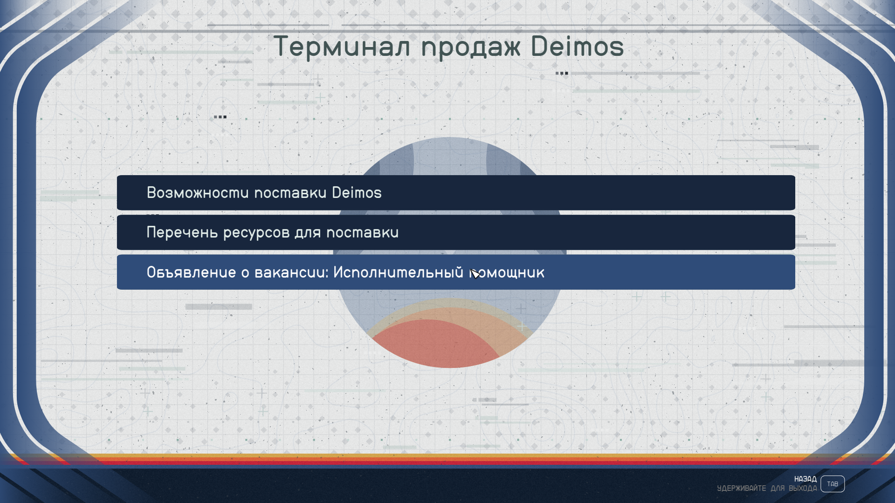
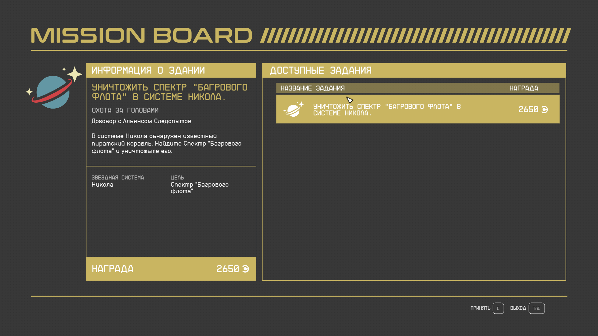

# starfield-mission-boards-everywhere
MISSION BOARDS EVERYWHERE! MI$$IOИ BOAЯД$ ЭVEЯYФHEЯE! - Starfield mod

1. Unpack file 
      > mb.zip
      
   from [releases](https://github.com/mistificator/starfield-mission-boards-everywhere/releases) section to
   
      > %USERPROFILE%\Documents\My Games\
      
2. Open Starfield console via ` and enter
      > bat mb
      
3. Enjoy mission board after exiting generic vertical operable terminals

* Welcome message at top-right corner

* Terminal is processed

* Redesigned interface

* Mission board on exit

